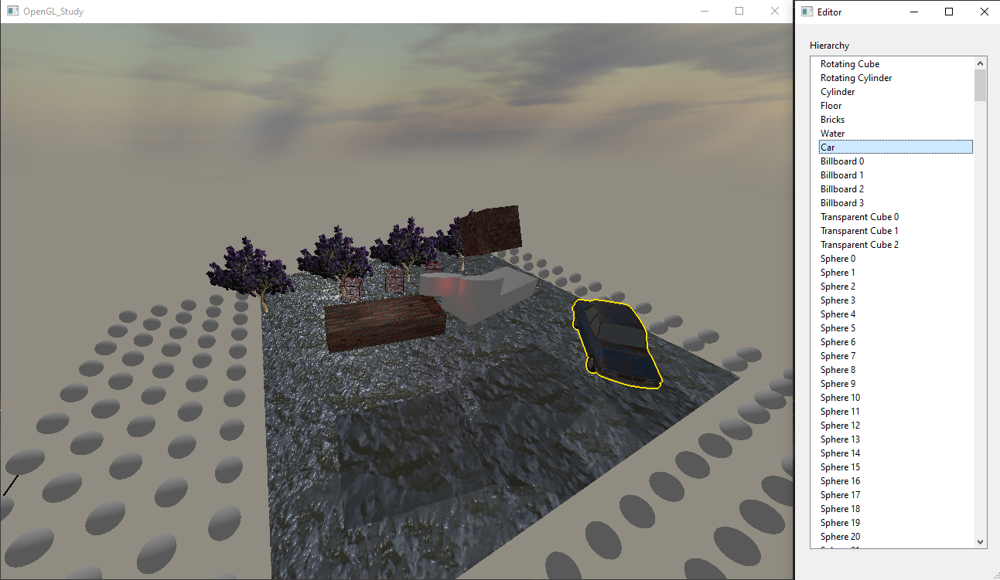

# OpenGL study project

Simple project to study how rendering works in games and how
game engines work.



## Implemented features

### Render Paths
Only forward rendering path is implemented for now

### Lighting
* PBR with Cook-Torrance BRDF
* Blinn-Phong lighting model

### Light sources
* Support for single directional light with shadows
* Support for several point lights
* Support for several spot lights with shadows

### Shader features
* Albedo textures
* Normal maps
* Multipass shaders based on tags
* Custom shader preprocessor - allows using `#include` instructions with GLSL
* Shader description in JSON - allows specifying passes, drawing parameters and default values for uniforms
* Alpha blending and alpha clipping

### Editor
* Scene hierarchy panel that lists all gameObjects - supports reparenting, renaming and destroying. Also outlines selected gameObjects.

### Other
* Skybox with cubemap
* Billboard renderer
* Opaque and transparent passes with different sorting and clear flags
* Instanced drawing (currently without support for per-instance data)
* Gizmoz rendering (pressing `G` in test scene will draw bounding boxes)

## Requirements

### OpenGL

* OSX
  * Should be installed by default

* Windows
  * Download GLEW binaries from http://glew.sourceforge.net/index.html
  * Place DLL files in `System32` and `SysWOW64` directories
  * Add paths to header and libs directories to `CMAKE_PREFIX_PATH`

### Boost

* OSX
  * Installed with `brew install boost` command

* Windows
  * Download sources from https://www.boost.org/users/download/
  * Build binaries from sources using https://www.boost.org/doc/libs/1_49_0/more/getting_started/windows.html#or-build-binaries-from-source (Section 5.2 Simplified build from source)
  * Add path to boost include and lib directories to `CMAKE_PREFIX_PATH`

#### Known issues

CMake might not set architecture tag for boost, and would not be able to find libs. In that case, add line `set(Boost_ARCHITECTURE -x64)` to CMake file 

In case of any problems, add `set(Boost_DEBUG ON)` line to CMake file

### Environment variables example

```
set CMAKE_PREFIX_PATH=F:/glew-2.1.0/include;F:/glew-2.1.0/lib/Release/x64;F:/boost_1_78_0;F:/boost_1_78_0/stage/lib;C:\freeglut-3.4.0\include;C:\freeglut-3.4.0\cmake-build-debug\lib
```

## External Tools

* [lodepng](https://github.com/lvandeve/lodepng)
* [OpenFBX](https://github.com/nem0/OpenFBX)

## How to build

Run this terminal commands inside source directory

```
cmake -S . -B build
```

Directory `build` will be created.

```
make -C build
```

Executable will be built to run application. Folder
`resources` will be copied before build.
Resources from that folder will be loaded at runtime.
It should always be in the same directory as the executable.
