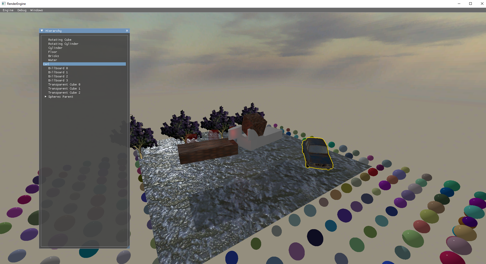

# Render Engine

The purpose of this project is to replicate rendering functionality that can be found in other
game engines, so all the API is very similar to Unity

This engine can run on Windows, MacOS and iOS, and uses OpenGL and Metal for rendering

## More documentation

* [How to Build](docs/HowToBuild.md)
* [Supported Features](docs/SupportedFeatures.md)
* [External Tools](docs/ExternalTools.md)